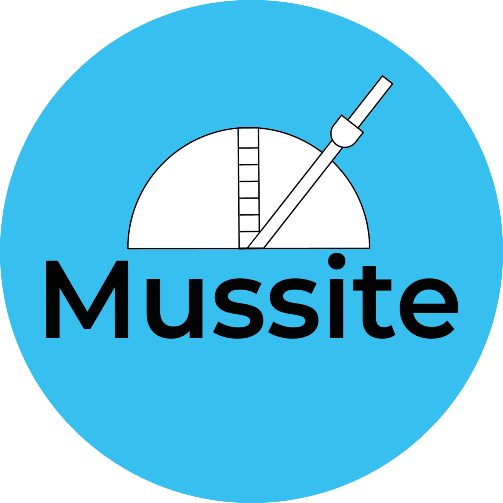
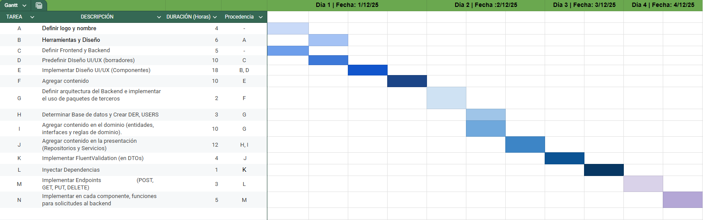

<h1 align="center"> Mussite | Galería y comunidad músical </h1>
<p align="center">
  
</p>

## 📌 Descripción

**Mussite** es una plataforma web destinada a compartir, visualizar y gestionar partituras musicales.  
Está pensada como una comunidad donde músicos puedan subir sus composiciones, encontrar otras obras y organizar material para estudio.

El proyecto sigue una **arquitectura de 3 capas** en el backend y utiliza tecnologías modernas en el frontend para ofrecer una experiencia fluida y responsiva.

---


---
## Diagrama de Gantt

<p align="center"> Inicio : 01/12/2025 | Fin : 04/12/2025 | Horas en total : 93 => en Dias : 4 </p>

---

## Diagrama PERT–CPM


---

## 🧰 Tecnologías utilizadas

### 🔹 Frontend
- **Svelte** (Framework SPA)
- **Vite** (dev server & build)
- **JavaScript (Fetch API)**
- HTML5 / CSS3
- Bootstrap (Framework CSS)

### 🔹 Backend
- **C# – .NET 8**
- ASP.NET Core Minimal API
- Dapper (Micro-ORM)
- MySqlConnector (Cliente ADO.NET para MySQL)
- Swagger / OpenAPI

### 🔹 Base de Datos
- **MySQL**
  
### 🔹 Herramientas
- **Git & GitHub**
- **Visual Studio Code**
### 🔹 Documentación del proyecto
- Diagrama de **Gantt** (PNG)
- Diagrama **PERT - CPM** (PNG)

## Arquitectura y Diseño

#### Arquitectura de 3 capas (Presentation, Application, Domain)

## 🚀 Ejecución del proyecto

### Backend

```bash
cd MussiteBackend/src/cSharp/presentation
dotnet run
```

### Frontend

```bash
cd MussiteFront
npm install
npm run dev
```
## 📦 Paquetes Utilizados en el Proyecto

### 🗄️ Acceso a Datos

* MySqlConnector (2.4.0)
* Dapper (2.1.66)

### 🧭 Mapeo y Transformación de Objetos

* Mapster (7.4.0)

### 📘 Documentación y API
* Microsoft.AspNetCore.OpenApi (8.0.21)
* Swashbuckle.AspNetCore (6.6.2)

### 🌐 Infraestructura y HTTP
* Microsoft.AspNetCore.Http.Abstractions (2.3.0)

### 🧪 Testing

* xUnit (2.4.2)

<h1 align="center"> E.T N°12 D.E 1° Libertador Gral. José de San Martín </h1>
<p align="center">
  
</p>

# Autor

* **Maycol Alconz**
  
## Información
- **Especialización:** Computación
- **Materia:** Análisis de sistemas  
- **Curso:** 5° 7°
- **Ciclo Lectivo:** 2025
---
